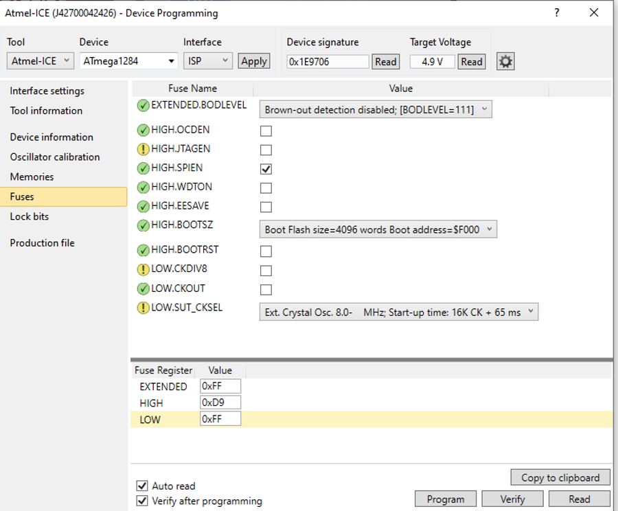

# OPET Firmware

OPET (Open PV Electrical Tool) is a programmable electronic load for long-term performance measurement of photovoltaic (PV) devices in the field or under controlled environmental conditions. This repository contains the firmware source code and prebuilt release binaries for the OPET microcontroller.

For related repositories, see:
- [OPET Hardware](https://github.com/NREL/opet-hardware) — PCB design and schematics
- [OPET Control Software](https://github.com/NREL/opet-control) — host-side control application
- [OPET Firmware](https://github.com/NatLabRockies/opet-firmware) - Original OPET firmware

This is an adaptation of the original repository of the OPET Firmware. Check thier documentation for basic functionality if needed.

# Adaptations

For the TUD monitoring station, the following modifications to the firmware were made.
- Included functionality for the MAX31856 T-type Thermocoupler sensor
    - added functions `void TEMP_MAX31856_Setup()` and `float TEMP_MAX31856_Measure()` for setting up and measuring the sensor in `MPPT_PCB_MCU__IO.c`. Sensor can be configured in the `main.h` by setting PCBconfig_TEMP_Sensor_Type to `Temp_Sensor__MAX31856`.
- Added Temperature variable to the IV curve data response
- Added MPPT_PCB_MCU__TEMP.c/h for monitoring the temperature for up to 8 ADC's (ADC121C021) which monitor 8 NTCs. Each time the main temperature measurement flag is set, all active ADCs will be read and converted to a temperature. Additionally the ADCs have an alert pin which is pulled high in case of overtemperature.
- Added new communication command `TEMP?` to monitor the temperature of the onboard NTC's and if configured the PV temperature and the temperature of each heat monitoring device. The reply will be in the form of `TEMP?\t<NTC1>\t<NTC2>\t<RTD>\t<T0>\t<T1>\t<T2>\t<T3>\t<T4>\t<T5>\t<T6>\t<T7>\t<MASK>\n`. Where `<NTC1>` and `<NTC2>` are temperatures of the onboard NTCs, `<RTD>` is the measured temperature of the PV module, `<T0>` till `<T7>` are the readings of the ADCs for the power dissipation device, and `<MASK>` shows an integer which if converted to binary encodes  the active adc's.
- If heat monitoring device is installed, it gives an error and shuts down the power in case of over temperature or if not enough devices give temperature readings. Errors can be read from the statusbyte. 
    - Bit 4 of `SysStatus_B` is set in case of overtemperature by checking the ADC reading
    - Bit 5 of `SysStatus_B` is set in case of overtemperature by checking the alert pin
    - Bit 6 of `SysStatus_B` is set in there are less readings then expected. This is a result of a communication error between the ADC and the OPET
- Two new eerom addresses for the temperature monitoring:  at `183`, the max temperature stored for the device and at `184` the number of monitoring devices can be configured. After writing a new value, make sure to restart the OPET.
- Temperature monitoring can be turned on/off by changing the SysConfig byte in EEROM at address 2. Bit 2 enables or disables the monitoring, while bit 0 configures the PV temperature monitoring. So setting SysConfig to 5 enables both PV, and heat dissipation device temperature monitoring, while setting it to 1 only monitors PV temperature.   

# How to use power dissipation device setup
There are two options, either you still need to flash the firmware on the OPET, or the newest firmware has already been installed. Your current firmware version can be checked with `opet.identification` which should be 1.16A-D08M03Y75. You can use the `helper.py` for example commands. Make sure to use [this](https://github.com/Kamerplant71/TUD-opet-control) GitHub repo for the new OPET control library.

You can configure the SysConfig byte to turn on the PV temperature measurement and the temperature monitoring of the power dissipation device. This byte is configured as
- Bit 0: Temperature sensor for PV (0 off, 1 on)
- Bit 2: Temperature sensing for power dissipation device (0 off, 1 on)

You can configure the SysConfig in EEROM. This is configured at address 2. Writing 5 to that addres will turn them both on. The temperature sensor can be configured at address 3. Write a 3 to that address to enable the MAX31856.

For the power dissipation device, you can configure the max temperature at address 183 and the number of power dissipation devices (and such amount of NTCs connected to the MOSFET) at address 184. After reconfiguring the OPET, make sure to reset it.

# Install firmware on OPET
By installing the firmware, you can directly configure your OPET correctly. You can compile and edit the firmware using [Microchip Studio](https://www.microchip.com/en-us/tools-resources/develop/microchip-studio). The main.h file is used to configure the hardware specifications of implementation. Under board hardware configurations you need to:
- Set the correct current version (15A, 340mA, 150mA) 
- Enable/disable the PV temperature sensing
    - If configured the sensor type
- Enable/disable temperature sensing for the power dissipation device
    - If configured the amount of power dissipation devices

There are more configurations dependend on the OPET board version you use. All of them are configured with the newest version. You can build the solution by pressing build and then build solution on the top part of the screen in Microchip Studio

Once your solution is built (or use on of the available releases in this repo) you can install the firmware on the OPET. You'll need a 24V power supply to power the OPET and an Atmel ICE programmer. You'll need to:

- Connect the Atmel ICE to a PC with the Microship Studio software
- Connect the cable to the AVR port on Atmel ICE programmer 
- Make sure to connect the other end to the ISP pin on the OPET with the tab on the connector towards the MCU chip.
- Connect the 24V to the OPET and turn on the supply
- In the Microchip Studio software, select the “tools” menu and select “device programming”
- In the pop-up select
    - Tool: Atmel-ICE
    - Device: ATmega1284 
    - Interface: ISP
- Click Apply
- Click Read to see if the Device signature, and Target Voltage (should read around 5V) are filled in.  
- Select Fuses on the left side
- Change the check boxes on the following settings
    - HIGH.JTAGEN : Disable
    - LOW.CKDIV8 : Disable
- From the LOW.SUT_CKSEL field select “Ext. Crystal Osc 8.0- Mhz; Start-up time 16k Ck + 65ms”
- It should look like as in the figure below and then click Program

- Select Production file on the left
- Select the .elf file of your compiled build
- Check Flash and EEROM boxes
- Click program
- Once complete, disconnect the power and the ISP pin and the OPET is ready.

Before using the OPET for your test case. Make sure to calibrate it first. For calibration check [OPET Control Software](https://github.com/NREL/opet-control).